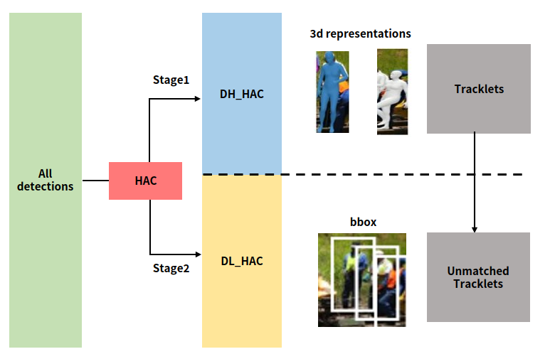

# HACTrack

HACTrack은 [ByteTrack](https://github.com/ifzhang/ByteTrack)의 검출 신뢰도 점수에 더해 상향식 2차원 자세 추정 정보를 더하여 검출 결과에 대한 정교한 외관 변화 정도를 결정하고, 이를 활용하여 다수 휴먼 추적을 수행하는 방법입니다


## [Installation and Setup]
### PHALP' 모델 실행

1. [4dhumans](https://github.com/shubham-goel/4D-Humans) 깃허브의 "dev branch"를 다음 명령어로 클론합니다:

    ```bash
    git clone --branch dev https://github.com/shubham-goel/4D-Humans.git
    ```
2. 생성된 4D-Humans 폴더 내의 Readme의 Installation and Setup의 안내를 따라 가상환경을 생성합니다. 가상환경 이름은 4D-humans입니다.
3. 생성한 4D-humans 가상환경에서 다음 명령어로 dev 브랜치의 PHALP 라이브러리를 설치합니다:

    ```bash
    pip install git+https://github.com/brjathu/PHALP.git@dev
    ```
4. 4D-Humans 폴더에서 다음 명령어로 PHALP'를 실행하여 확인합니다:

    ```bash
    python track.py video.source="example_data/videos/gymnasts.mp4"
    ```


### PoseTrack 데이터셋 test 코드 수정 및 데이터셋 다운로드

1.칼만 필터를 위해 추가 라이브러리를 설치합니다:
```bash
pip install filterpy
```
2. 본 repository의 `track.py`로 `track.py`를 대체합니다.
3. [T3DP](https://github.com/brjathu/T3DP?tab=readme-ov-file)의 '_DATA' 파일을 4D-Humans 폴더에 다운로드합니다.
4. [PoseTrack21](https://github.com/anDoer/PoseTrack21.git)을 통해 PoseTrack 이미지와 PoseTrack21에 대한 어노테이션을 다운로드 합니다. 안내사항을 따라 이메일을 통해 토큰을 전달받은 후 다운로드 해야하므로 시간이 조금 소요될 수 있습니다. annotations.zip파일의 PoseTrack21/posetrack_mot/mot/val 폴더를 PATH to PoseTrack21/eval/posetrack21/posetrack21/data/gt/PoseTrackReID/posetrack_data/mot에 위치시킵니다.
5. `track.py`의 line 69에서 PoseTrack 이미지 데이터셋 경로를 알맞게 수정합니다.
6. `PHALP.py`로 PATH to Anaconda/envs/4D-humans/lib/python3.10/site-packages/phalp/trackers/PHALP.py를 대체합니다.
7. HACTrack에 따라 분류된 [detections](https://drive.google.com/file/d/1XT74B-isv_3MlvxA5-0pFu6SRRnn5Cd5/view?usp=sharing)을 다운로드합니다.
8. `PHALP.py`의 line 197의 경로는 8번 파일의 경로로 수정합니다.
9. 본 repository의 `tracker.py`로 PATH to Anaconda/envs/4D-humans/lib/python3.10/site-packages/phalp/external/deep_sort/tracker.py를 대체합니다.
10. 4D-Humans 폴더에서 다음 명령어를 실행합니다:

    ```bash
    python track.py
    ```


### Test 결과 후처리

1. Posetrack validation 데이터셋의 170개의 시퀀스에 대한 결과는 `4D-Humans/outputs/results`에 시퀀스 별로 pkl로 저장됩니다.
2. 본 repository의 `create_txt.py`로 `eval.py`를 대체하고 다음 명령어로 170개의 시퀀스를 posetrack_phalp.pkl로 통합 후 txt 폴더내 170개의 txt 파일로 변환합니다:
    ```bash
    python crate_ext.py PATH to 4D-Humans/outputs/results phalp posetrack
    ```
3. 2의 결과로 생성된 txt 폴더의 경로는 tracker 최종 결과 경로입니다.

   
### Evaluation 

1. [TrackEval](https://github.com/JonathonLuiten/TrackEval.git)을 다운로드하고 설치합니다:

    ```bash
    python setup.py install
    ```
2. 본 repository의 아래 코드를 PoseTrack21 폴더에서 실행하여 GT txt 파일을 전처리합니다. 이는 PoseTrack21에 대한 GT입니다. 이때, line 7과 9의 경로를 알맞게 수정합니다. 
   
    ```bash
    python gt_processing.py
    ```
3. 본 repository의 posetrack_mot.py로 PATH to PoseTrack/eval/posetrack21/posetrack21/trackeval/datasets/posetrack_mot.py를 대체합니다.
4. posetrack_mot.py의 line 21은 추적 결과인 txt 폴더의 상위 경로로 수정합니다.
5. 추가 라이브러리 설치
   ```bash
    pip install shapely
    ```
4.  PATH to PoseTrack/eval/posetrack21/scripts/run_mot.py로 평가를 수행합니다. 결과는 tracker 별 txt 폴더 내에 저장됩니다.
